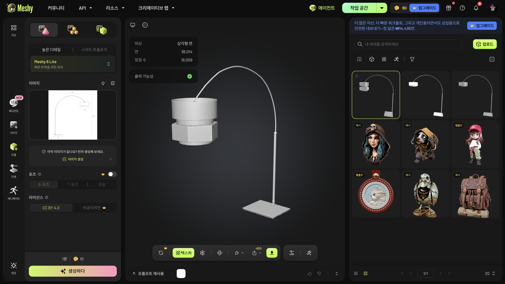

# Physical Computing

🏠 **About This Project**

- Exploring how my room can be represented and edited in a browser.
- Building a Three.js room layout with box primitives, alongside a room scan and an AI-generated floor lamp asset.
- Connecting spatial representation, 3D assets, and interaction prototyping.

---

💻 **Current**

- An interactive room editor with 11 objects: a bed, floor lamp, nightstand, piano, two curtains, bookshelf, wardrobe, clothes rack, balcony door, and window.
- Each object is represented by a single box primitive.
- Editable colors, position, dimensions, and rotation, with top and perspective views.
- Browser-local layout saving and `const OBJECTS` code export.
- A provisional room size of 4.8 × 4.8 m, based on a layout sketch rather than measured dimensions.

---

## 📂 Files & Assets

**[room-template.html](room-template.html)**

- The main room editor, built with HTML/CSS, JavaScript, and Three.js.
- Select an object in the scene or dropdown to adjust its main color, top-face color, position, size, and rotation.
- Toggle the balcony door, align objects to the floor, or restore the default layout.
- The clothes rack sits between the window and balcony door.
- Save changes in the current browser, or export the configuration and paste it into the file's `const OBJECTS` section. Browser saving does not update this repository.

**[Assets/Floor-lamp-ai-generated.glb](Assets/Floor-lamp-ai-generated.glb)**

- An AI-generated floor lamp model in binary glTF format, exported with Meshy.
- A separate detailed mesh asset for future scene experiments.
- The current room editor displays the lamp as a box; it does not load this model.

**[Assets/Kihyun'sRoom1.spz](Assets/Kihyun%27sRoom1.spz)**

- Room scan data stored in SPZ format for Gaussian splat viewing experiments.
- A separate asset from the editable box layout.
- Requires a viewer that supports SPZ; the current room editor does not load this scan.

**[Assets/Meshy-ai-Screenshot.png](Assets/Meshy-ai-Screenshot.png)**

- A screenshot of the floor lamp modeling workspace in Meshy.
- Shows the reference image, generated lamp preview, and model variants.
- A visual record of the asset creation process.

---

## 🚀 Getting Started

- Download or clone this repository.
- Open `room-template.html` in a modern browser with WebGL support.
- An internet connection is needed to load Three.js from the CDN.
- Drag to orbit, scroll to zoom, and right-drag to pan.
- Use **평면 보기** for the top view and **입체 보기** for the perspective view.

**Editing the Layout**

- `size`: width, height, and depth in meters, before rotation.
- `pos`: the object's center position `[x, y, z]` in meters.
- `rotation`: rotation around the vertical axis, in degrees.
- `color` / `accent`: the main color and top-face color.
- In the top view, right is `+X`, the top of the sketch is `−Z`, and height is `Y`.

---

## 🛠️ Tools & Concepts

**Web & Interaction**

- HTML/CSS and JavaScript
- Three.js, OrbitControls, and raycasting
- Browser local storage

**Spatial Representation**

- Box primitive room layouts
- GLB mesh assets
- SPZ Gaussian splat data
- AI-assisted 3D asset creation with Meshy

---

📝 **Draft Notes**

- This README is an initial project description.
- The box editor, scan, and detailed lamp model are currently separate resources. Asset loading and sensor integration are not implemented in this repository's room editor.
